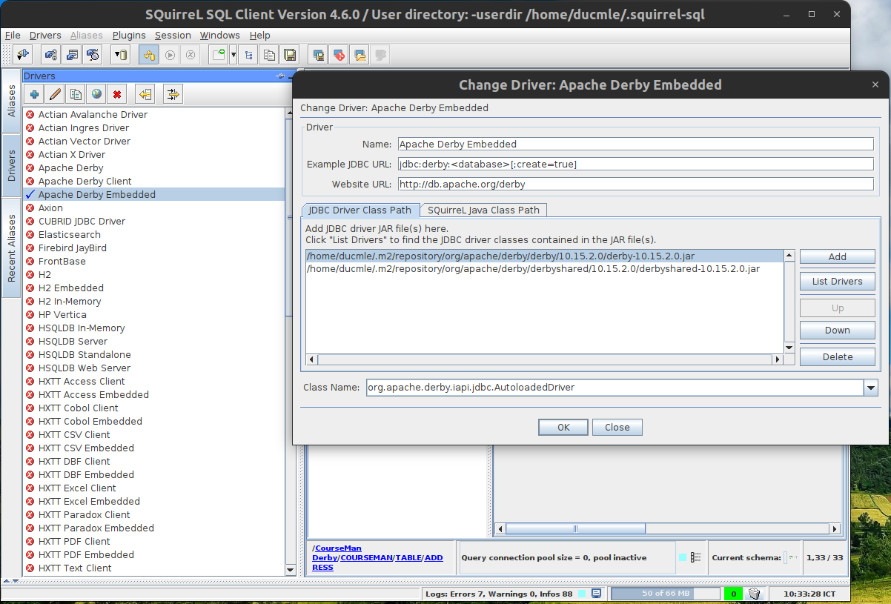
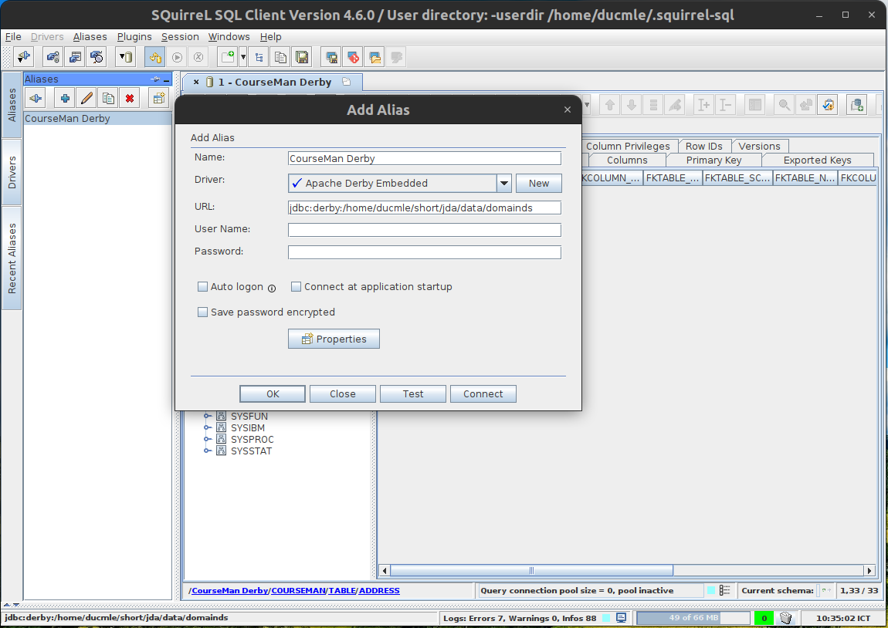
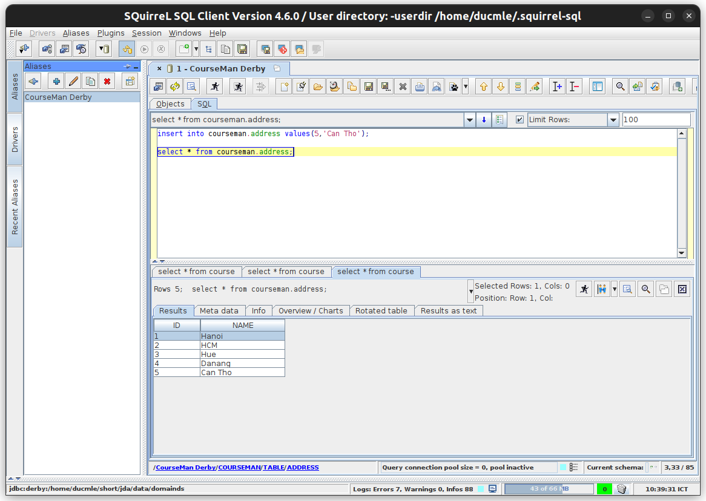

# Overview

JDA (previously known as `JDomainApp`) is a [multi-module Maven project](https://books.sonatype.com/mvnex-book/reference/multimodule.html) that implements Domain-Driven Design in Java. Key features of JDA include:

1. **Micro software architecture** (MOSA) which modularises the core domain model in micro-modules (one domain class per module). The architecture is also layered, MVC-enabled and service-ready (supports both RESTful and microservices).
2. MOSA consists in **3 main layers**: domain model (the core) layer, module layer and software layer. Each layer is described in a model.
3. **aDSL (annotation-based DSL)** is used to express the models directly in OOPLs
4. Language: Java
5. Deployed as a multi-module Maven project: each main feature is implemented in a separate module project, allowing them to be selectively imported into software projects

## Research and Development
JDA's development started in 2012 as a teaching tool in a software engineering subject at Hanoi University (Vietnam). It was first named jDomainApp, which means that it is a Java-based tool for domain-driven application development.

In 2014, the development of DomainAppTool, which is based on jDomainApp, began when a need was realised for a user-friendly tool that can be used to quickly and interactively
execute and test the domain model. 
We observe that the development of DomainAppTool and, more generally, that of the
jDomainApp framework continuously evolves. The tool is used not only to demonstrate the
framework’s capabilities but to quickly experiment with any new domain modelling ideas that
would eventually be incorporated into the framework. 

The 2016-2019 period played a crucial role in the framework's development. Three conference
papers were published with an aim to consolidate and formalise (to a certain extent)
the core theories that underlie the framework and tool. Two papers, in particular,
are the collaborative research works between the framework's author and Dr. Duc-Hanh Dang and Dr. Ha-Viet Nguyen from the Department of Software Engineering (VNU University of
Engineering and Technology). These works were later developed into two ISI journal papers.

Another major development of the framework started very recently in **2021** when the framework received a 2-year funding to develop the microservices capabilities. This project has just completed the first phase and is currently in the start of the second phase. Also starting with this project, jDomainApp is officially renamed to become **JDA**.

At this point, we feel that JDA is stable enough to be released  and thus decided to make the source code public. There are still issues to be resoved and untappeded potential to be explored. We hope that the framework would be used in software development and look forward to contributions by developers.

# Projects
## Level 1
1. [MSA-based software constructor](https://github.com/jdomainapp/jda/issues/90)
2. [BackEnd generator](https://github.com/jdomainapp/jda/issues/16)
3. [FrontEnd generator (version 1.1)](https://github.com/jdomainapp/jda/issues/93)
4. [JDA fullstack tool](https://github.com/jdomainapp/jda/issues/59)
5. [JDA mobile](https://github.com/jdomainapp/jda/issues/60) (`jda-mobile`)
6. [JDA testing](https://github.com/jdomainapp/jda/issues/63) (`jda-test`)
7. [JDA domain model](https://github.com/jdomainapp/jda/issues/61) (`jda-dom`)
8. [Domain validator](https://github.com/jdomainapp/jda/issues/66) (`jda-dom-validator`)

## Level 2
1. [JDA DODM: enhanced support for data management](https://github.com/jdomainapp/jda/issues/65)
2. [Software specification: consolidation and extension (frontend, backend, generator, etc.)](https://github.com/jdomainapp/jda/issues/32)
3. [JDA security](https://github.com/jdomainapp/jda/issues/62) (`jda-security`)

## Level 3
1. [App: DDDNet](https://github.com/jdomainapp/jda/issues/67) `jda-app-dddnet`
2. Other apps that use JDA: TBC

## Staff and Students
### Current
|        Staff        | Student? | Projects | Note                           | 
|:-------------------:|:--------:|:--------:|:-------------------------------|
|   Nguyen Van Cong   |          |   1.1    |                                |
|  Nguyen Thuy Linh   |          |   1.1    | green energy app               |
|  Luu Dao Dung Tri   |    x     |   1.5    | linked to internship & IoT lab |
|    Tran Duc Anh     |    x     | 1.2, 1.3 | TBC                            |
| Nguyen Dang Duc Anh |    x     |   1.3    |                                |
|     Hoang Khue      |    x     | 1.3, 1.4 |                                |
|     Vu Thanh Ha     |          |   MDSA   | Software Engineer              |
### Past
|        Staff        | Student? |                    Projects                    | Note                           | 
|:-------------------:|:--------:|:----------------------------------------------:|:-------------------------------|
|   Tran Quang Linh   |    x     | FrontEnd generator, React/Native (version 1.0) | Masters, VNU-UET, 2023         |
|    Tong Van Hai     |    x     |    FrontEnd generator, Vuejs (version 1.0)     | Masters, VNU-UET, 2023         |
|      Hai Binh       |    x     |               MOSAR version 1.0                | Graduation project, HANU, 2020 |


# JDA project structure and documentation
Most of the feature documentations are written as ReadMe.md file in the framework modules that implement them. Thus, it is important to understand the JDA project structure and to browse it for detailed explanation of the features.

In Maven's terminology, a **module** is implemented as an **artifact project**.

JDA has a root (top-level) project whose structure is as follows:

```
jda:root	-> the root project
  common  -> module-common: (base) module used by other modules
  :dcsl    -> module-dcsl: implements DCSL language (used by most other modules)
  jda:main -> contains the core components of JDA
  jda:modules:root -> consists of independent modules that extend the core
  	:mbsl    -> implements MBSL language
  	:mccl    -> implements MCCL language
  	:sccl    -> implements SCCL language
    :restful  -> implements restful service
    ...
  jda.examples:root -> consists of application examples for JDA
  	jda.examples:courseman  -> coursemain examples
  	  jda.examples.courseman:basics
      :basics2
      :extsoftware
      :soict2019
    - jda.examples:drawing
    - :kengine
    - :processman
    - :vendingmachine
    - ...
```

# Documentation

## Course book on JDA tool
URL: [JDA software tool basics](https://drive.google.com/file/d/1fYWag7t3r7z2oOCXQRVOSZx_BEkAHsqs)

Chapters 1-4 cover DCSL, how to develop the domain model using DCSL and the user interface of the JDA Tool.
Overall, these chapters help demonstrate the basic solution for the software generation problem that JDA is designed to address. The enhanced software generation capabilities of JDA, that are being developed, are based on this basic design.

Listed at the back of each chapter are a number of exercises that should be used for practice. 

# Dependencies
Generally, the dependencies are configured for each project. However, due to historical reasons, JDA currently has some special dependencies that need to be installed manually. 
Follow the instructions below to install these dependencies.

## Install dependencies from `local-maven-repo`

These dependencies are located in the `jda/local-maven-repo` directory:

1. `jayway-jsonpath`

```
mvn install:install-file -Dfile=local-maven-repo/jayway/jsonpath/json-path/2.4.0/json-path-2.4.0.jar -DpomFile=local-maven-repo/jayway/jsonpath/json-path/2.4.0/json-path-2.4.0.pom
```

2. `jscaledhtmltextpane`

```
mvn install:install-file -Dfile=local-maven-repo/jscaledhtmltextpane/jscaledhtmltextpane/unknown/jscaledhtmltextpane-unknown.jar -DpomFile=local-maven-repo/jscaledhtmltextpane/jscaledhtmltextpane/unknown/jscaledhtmltextpane-unknown.pom
```

3. `scrollabledesktop`

```
mvn install:install-file -Dfile=local-maven-repo/scrollabledesktop/scrollabledesktop/unknown/scrollabledesktop-unknown.jar -DpomFile=local-maven-repo/scrollabledesktop/scrollabledesktop/unknown/scrollabledesktop-unknown.pom
```

# JDA Examples
JDA comes with a set of example applications that demonstrate different subsets of features. Refer to the ReadMe files in the [`examples`](examples/ReadMe.md) project for details. 

# How-tos

**REMEMBER:** Always perform commands on a module project **from the JDA root** directory:

## Install a project

From the root folder of the project, type this command:

`mvn clean install -DskipTests=true`

## Work with an artifact project in Eclipse

1. Use the "Import existing Maven project" to import the artifact project you want to work with
   - browse to the artifact folder and select it's pom on the dialog
2. Configure the source code and test directories following the Maven standard:
   1. If the project has already been imported before and its Eclipse's `.classpath` has been commited then you just need to verify that the source code directories have their respective output directories set correctly (see below)
   2. Add these two source directories to Eclipse:
      - main source code: `src/main/java`
      - test source code: `src/test/java`
      - (optional) example source code: `src/example/java`
   3. Ensure the following output directory arrangement:
      - `src/main/java` -> `target/classes` (default)
      - `src/test/java` -> `target/test-classes`
      - `src/example/java` -> `target/example-classes`
3. Eclipse will automatically look for dependencies in the local repo, and if not found then download them from Maven Central

## Compile a module project

1. cd into the JDA's root directory
2. type this command, where replace `module-X` by the actual module artifact name:
   ```
   mvn clean compile -pl :module-X -am
   ```
   - Option `-am` is needed to compile the projects that this module depends on 
  
## Package a module project

1. cd into the JDA's root directory
2. type this command, where replace `module-X` by the actual module artifact name:
   ```
   mvn package -pl :module-X -am -DskipTests=true
   ```
   - Option `-am` is needed to compile the projects that this module depends on 
   - Option `-DskipTests=true` is used to skip executing the JUnit tests

## Deploy a module project
This requires creating a single **assembly** containing all the project resources (not just the compile classes)

1. create a `deploy.xml` file for the module, place it in the folder `src/main/assembly`
2. update `pom.xml` to configure it to read `deploy.xml` as part of the `package` task
3. cd into the module's directory
4. Type this command:
   ```
   mvn package
   ```
   (add the option `-DskipTests=true` if needed)

## Deploy a module project together with test classes
TODO: update this section to extend the deployment task in the previous section.

This creates an assembly that contains everything from the previous section plus all the test classes.

1. Check that `maven-assembly-plugin` is added to the JDA root's `pom.xml` and configured
2. Copy the template `assemply-test.xml` file to the module's directory
3. Edit `pom.xml` to add 2 goals as shown in the template `pom.xml`:
   1. one uses `maven-jar-plugin` with the `test-jar` goal
   2. the other uses `maven-assembly-plugin` with the `single` goal
4. cd into the JDA's root directory
5. Type this command, replace `module-X` by the actual module artifact name:
   ```
   mvn clean compile test-compile assembly:single -pl :module-X -am
   ```
  - the `test-compile` target is to ensure that test sources are compiled

## Run a program

`bin/mvn-java.bash <artifact> <FQN-program-class>`

## Run a test program 

Given:
- module whose artifact-id is `jda-X`
- JUnit test class (in `src/test/java`): `TestClass`
- test method of the test class: `testMethod` (omitted if run all test methods)

To run the JUnit test above:
```
mvn test -pl :jda-X -Dtest=TestClass#testMethod
```

### Short-cut commands
- run normally (terminates after completed): 
  
  `bin/mvn-test.bash <artifact> <FQN-JUnit-test-class>`

- run without termination (as a daemon, useful for GUI-typed test programs):
(this does not work correctly yet!)

  `bin/mvn-test-daemon.bash <artifact> <FQN-program-class>`

## Create a Maven project that uses JDA's modules as dependencies

1. Create a Maven project
- Example APP: `courseman-address`
- qualified artifact name (QAN): `org.jda.example.coursemanmsa.address-service`

```
mvn archetype:generate -DgroupId=org.jda.app -DartifactId=courseman-address -DarchetypeArtifactId=maven-archetype-quickstart -DarchetypeVersion=1.4 -DinteractiveMode=false
```
2. Edit `$APP/pom.xml` to add the JDA's Github repository and a dependency for the JDA module. This module is stored on the repository

```
...
   <repositories>
     <!-- JDA's deployment repository on GitHub -->     
     <repository>
       <id>github-jda</id>
       <name>JDA: GitHub Apache Maven Packages</name>
       <url>https://maven.pkg.github.com/jdomainapp/jda</url>
     </repository>
   </repositories>

  <dependencies>
   ...
   <!-- JDA module artifact (stored on the repository (above)) -->
    <dependency>
     <groupId>org.jda.example.coursemanmsa</groupId>
     <artifactId>address-service</artifactId>
     <version>0.0.1-SNAPSHOT</version>
    </dependency>
  </dependencies>

```

3. Configure your authentication to the JDA's Github repository in `~.m2` repository
- Create file `~.m2/settings.xml` with the following content. Replace the user name and password fields with your own:

```
<settings xmlns="http://maven.apache.org/SETTINGS/1.0.0"
  xmlns:xsi="http://www.w3.org/2001/XMLSchema-instance"
  xsi:schemaLocation="http://maven.apache.org/SETTINGS/1.0.0
                      http://maven.apache.org/xsd/settings-1.0.0.xsd">

  <activeProfiles>
    <activeProfile>github</activeProfile>
  </activeProfiles>

  <profiles>
    <profile>
      <id>github</id>
      <repositories>
        <!-- JDA -->
        <repository>
          <id>github-jda</id>
          <url>https://maven.pkg.github.com/jdomainapp/jda</url>
          <snapshots>
            <enabled>true</enabled>
          </snapshots>
        </repository>
        <repository>
          <!-- for testing -->
          <id>github-test</id>
          <url>https://maven.pkg.github.com/jdomainapp/test</url>
          <snapshots>
            <enabled>true</enabled>
          </snapshots>
        </repository>
      </repositories>
    </profile>
  </profiles>

  <servers>
    <server>
      <id>github-jda</id>
      <username>YOUR-GIT-USER-NAME</username>
      <password>YOUR-PASSWORD-OR-ACCESS-TOKEN</password>
    </server>
    <server>
      <id>github-test</id>
      <username>YOUR-GIT-USER-NAME</username>
      <password>YOUR-PASSWORD-OR-ACCESS-TOKEN</password>
    </server>
  </servers>
</settings>
```

4. Install the app
First ensure that the dependencies in the `local-maven-rep` are installed. See a previous section.

Then, issue this command:
```
mvn install
```

The app is then installed in the local `.m2` repository. For our $APP example, it should be something like this `~.m2/repository/org/jda/example/coursemanmsa/address-service/0.0.1-SNAPSHOT/address-service-0.0.1-SNAPSHOT.jar`

## Run a JDA module app

For modules that implement app examples (e.g. microservice apps), use the following steps to package the app with all the dependencies (incl. JDA ones) and then run the app:

1. Package the app
Use `mvn package` to package the app.

If the JDA module was created as a Spring-Boot project, make sure to package and deploy that module as such, using this command:

```
mvn clean package spring-boot:repackage
```

the application is then packaged as a `.jar` file in the `target` directory

2. Run the app from the JAR file with the `java -jar` command:
Example:
```
java -jar target/address-service-0.0.1-SNAPSHOT.jar
```

## Run a JDA's module application in a Docker container
1. Pull the JDA run-time docker image, named `jdare`,  from Docker's Hub: https://hub.docker.com/repository/docker/ducmle/jdare/general. 
   - Use the image with the `latest` tag

2. Run the necessary infrastructure services of the app on the **host machine**. These may include a combination of the followings (depending on the type of application): database, configuration server, discovery server, gateway server, Kafka server, etc.
3. Create a Docker container from the `jdare` image with a shell prompt. This container will be used to run the app in the next step:

```
docker run --name jdare -it --network host ducmle/jdare:latest bash
```

Option `--network host` is only needed if you are running microservices applications. It allows your application (running from within a container) to expose ports for public access through the host machine and also to allow your application to access the host machine's infrastructure services  

4. Copy the application jar file to the container
Use the `docker cp` command on the host machine. For example:
```
docker cp target/courseman-address.jar jdare:/jda/courseman-address/
```
will copy the jar file `target/courseman-address.jar` to the application directory `/jda/courseman-address` in the container named `jdare`.
If the application directory does not yet exist, create it first.

5. From the shell of the Docker container, run the application `.jar` file, using the `java -jar` command.

## Run multiple instances of a JDA's module application in different Docker containers
If your JDA's module app exposes an application port (e.g. 8080) and multiple instances of the app needs to be executed then you can run each instance in a separate Docker container, mapping the application port in each container to a different host port.

1. Same as running a single instance app (see above)

2. Almost the same as running a single instance app (see above).

Note, however, that, instead of using `localhost` you must specify a host name in all the configurations of the JDA module app.

Suppose the infrastructure servers are `inf-server1`, `inf-server2`, etc.

3. For each application instance, run a Docker container from the same `jdare` image with a shell prompt. The options are different from the case of running a single instance. Change the host port for each container!

```
docker run --add-host=inf-server1:host-gateway --add-host=inf-server2:host-gateway -p 7070:8082 --name jdare -it ducmle/jdare:latest bash
```

- Instead of using `--network host`, we use `-p` to expose the application port (8080) to a specific host port (7070). Change this host port for each container!
- the `--add-host` options use the `host-gateway` value to map each infrastructure server (started in the previous step) to the host machine

4. Copy the application jar file to the container
   Use the `docker cp` command on the host machine. For example:
```
docker cp target/courseman-address.jar jdare:/jda/courseman-address/
```
will copy the jar file `target/courseman-address.jar` to the application directory `/jda/courseman-address` in the container named `jdare`.
If the application directory does not yet exist, create it first.

5. From the shell of the Docker container, run the application `.jar` file, using the `java -jar` command.

## Configuring the host machine's PostgreSQL server to allow connections from multiple app instances

When developing multiple-instance app (e.g. microservices), you may want to reuse a Postgresql database running on the host machine for all the instances. 

1. Configure `pg_hba.conf`
In order for PostgreSQL server to accept connections from any IP address on the network, add the following entry to file `pg_hba.conf`.
```
host    all             all             0.0.0.0/0            md5
```
2. Configure `pg_ident.conf`
In addition, in order for PostgreSQL to permit your app's database user to login in, add the following entry to your `pg_indent.conf` file. Suppose the database user is `admin`:
```
# MAPNAME       SYSTEM-USERNAME         PG-USERNAME
admin	          my-system-user-name     postgres
```

Replace `my-system-user-name` by your actual logged-in user of the host machine.

## Using Squirrel SQL Client (GUI) to work with Apache Derby

1. Download and install latest version of Squirrel SQL client (use the provided jar file)

URL: http://www.squirrelsql.org/index.php?page=home#installation

2. Configure Apache Derby JDBC driver

  - needs both files `derby.jar` and `derbyshared.jar`
  - folder paths point to the local Maven repository folders of Apache Derby, which are as follow (`x.y.z` is the version string):
    - `derby.jar` => `$USER_HOME/.m2/repository/org/apache/derby/derby/x.y.z/derby-x.y.z.jar`
    - `derbyshared.jar` => `$USER_HOME/.m2/repository/org/apache/derby/shared/x.y.z/derby-x.y.z.jar`
  - use the "List Drivers" button to automatically find the driver class

The following screenshot shows an example configuration for the Apache Derby Embedded driver. This is the driver mode for the standard use of the database in the CourseMan examples.  




3. Create a connection alias to the db
   - For CourseMan examples, path to the db directory is in the `data` subfolder of your project directory (e.g. `.../data/domainds`), as shown in the image below


4. Use the SQL editor to work with the data


