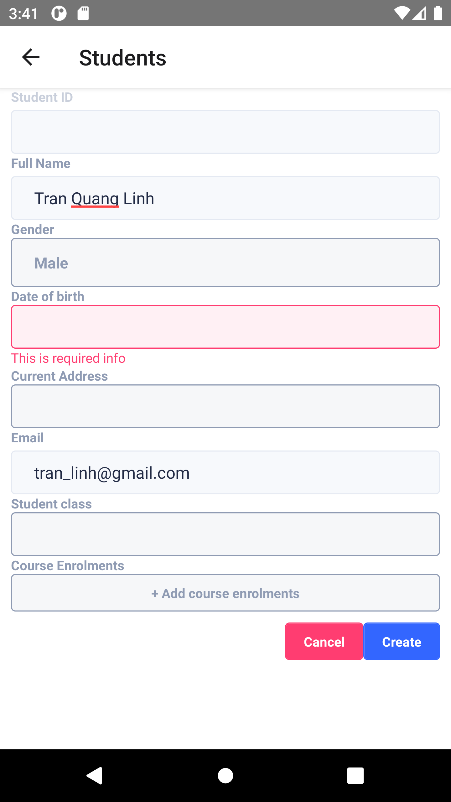
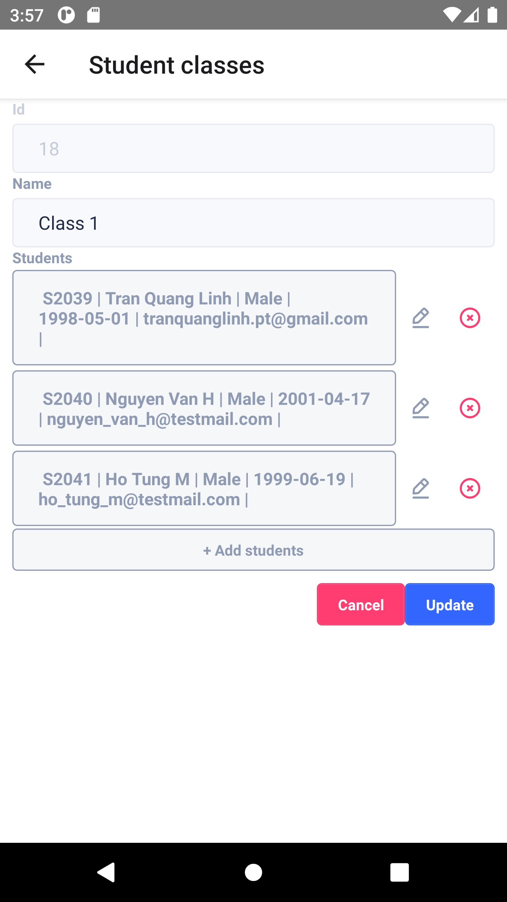

# React Native App (generated by JDA)

## Table of contents

1. [Environment setup](#1-environment-setup)
2. [Run application](#2-run-application)
3. [App features](#3-app-features)
4. [File structure](#4-file-structure)
   - [The src/base folder](#the-srcbase-folder)
   - [The src/data_types folder](#the-srcdatatypes-folder)
   - [The src/modules folder](#the-srcmodules-folder)

# **1. Environment setup**

Follow environment setting for Reactnative in [here](https://reactnative.dev/docs/environment-setup).

# **2. Run application**

## Install dependencies

```
$ npm install
```

Run prettier to beautify the generated code (optional)

```
$ npm run prettier
```

## Start application

To start the application in android device/emulator:

```
$ npm run android
```

or in IOS device/simulator:

```
$ npm run ios
```

You might need to configure some more to run your app in IOS, follow this [instruction](https://reactnative.dev/docs/running-on-device)

<details>
   <summary>Example output:</summary>

```
D:\JDA\CourseManReactNative>yarn android
yarn run v1.22.17
$ react-native run-android
info Running jetifier to migrate libraries to AndroidX. You can disable it using "--no-jetifier" flag.
Jetifier found 1214 file(s) to forward-jetify. Using 6 workers...
info Starting JS server...
* daemon not running; starting now at tcp:5037
* daemon started successfully
info Launching emulator...
info Successfully launched emulator.
info Installing the app...
Starting a Gradle Daemon, 2 incompatible and 1 stopped Daemons could not be reused, use --status for details

> Task :app:installDebug
Installing APK 'app-debug.apk' on 'Pixel_4_API_29(AVD) - 10' for app:debug
Installed on 1 device.

Deprecated Gradle features were used in this build, making it incompatible with Gradle 7.0.
Use '--warning-mode all' to show the individual deprecation warnings.
See https://docs.gradle.org/6.9/userguide/command_line_interface.html#sec:command_line_warnings

BUILD SUCCESSFUL in 47s
137 actionable tasks: 2 executed, 135 up-to-date
info Connecting to the development server...
8081
info Starting the app on "emulator-5554"...
Starting: Intent { cmp=com.coursemanreactnative/.MainActivity }
```

</details>

## Working with local back-end server (Android only)

You need to bind a port on your Android device to a port on your computer that allow Front-end application communicating with Back-end server.

Suppose that your back-end run at port 8080:

```
$ adb reverse tcp:8080 tcp:8080
```

# **3. App features**

A ReactNative app generated by JDA from a DDD model provides a set of common features (CRUD data), which can be found in vary common application. This session describes common View Components that provide these features.

| Component        | Description                                                                                                                                                                                                                                                                                                                                                                                                                                                                                                                                                                                                                                                        | Sample screenshot                                                           |
| ---------------- | ------------------------------------------------------------------------------------------------------------------------------------------------------------------------------------------------------------------------------------------------------------------------------------------------------------------------------------------------------------------------------------------------------------------------------------------------------------------------------------------------------------------------------------------------------------------------------------------------------------------------------------------------------------------ | --------------------------------------------------------------------------- |
| 1. Home screen   | Work as a modules browser, home screen allows user to browse to module screens                                                                                                                                                                                                                                                                                                                                                                                                                                                                                                                                                                                     |                |
| 2. Module screen | As default, a module screen includes ListView (showed as default) and FormView. <br/> From ListView of module screen, user can: <br/> &nbsp;&nbsp; - Tap to "Add" button for opening "Create Form" screen <br/> &nbsp;&nbsp; - Tap to a list item for opening "Read only Form" screen <br/> &nbsp;&nbsp; - Tap to "Edit" button (pen icon) placed on each list item for opening "Edit Form" screen for a list item <br/> &nbsp;&nbsp; - Tap to "Delete" button (trash icon) placed on each list item for deleting a list item <br/> &nbsp;&nbsp; - Using page natigator for navigate between pages (default 20 items/ page)                                        |        |
| 3. Form screen   | Support 3 modes: "Create", "Update" & "Read only". <br/> &nbsp; &nbsp;- In the "Create" and "Update" mode, ID field and automatic field (generated by server) will be disabled <br/> &nbsp; &nbsp;- In "Read only" mode, all input fields will be disabled <br/> Support "Module Input" and common input : "String", "Number", "Date", "Enum", v.v. <br/> Support data validation for common types of data:<br/> &nbsp; &nbsp; - Required (true \| false) - any data <br/> &nbsp; &nbsp; - Max/min (number) - number data only <br/> &nbsp; &nbsp; - Max length/ min length (number) - text data only <br/> &nbsp; &nbsp; - Pattern (regex string)- text data only |  |
| 4. Module Input  | Module input allows user to chose a module record data as a field data in other module form data. <br/> &nbsp; &nbsp; - If a module record data selected via module input, user can tap to module input for opening detail screen of that module record data <br/> &nbsp; &nbsp; - Else, a bottom sheet will be showed with list of module record data for selecting. User can use search box for quick search data (**_Note that this feature has not work yet due to lacking search api of backend server_**) and "Create" button for creating new record data if data not exits                                                                                 |         |
| 5. Multi Input   | Multi input allow form data to save a list of same type data in one field data. Each input field in Multi input work as same as a normal input.                                                                                                                                                                                                                                                                                                                                                                                                                                                                                                                    |          |

# **4. File structure**

While many files are generated by JDA which depend on content of DDD model, there exits a base high-level file structure that remains consistent for all ReactNative app.

## **Structure**

```
<AppName>
|─── android
|─── ios
|─── node_modules
|─── src
|    |─── base
|    |─── data_types
|    |─── modules
|─── app.json
|─── App.tsx
|─── index.js
|─── package.json
|─── tsconfig.json
```

| Directory / File | Description                                                                                                                                                                                 |
| ---------------- | ------------------------------------------------------------------------------------------------------------------------------------------------------------------------------------------- |
| android          | Contains the Android studio project                                                                                                                                                         |
| ios              | Contains the Xcode project                                                                                                                                                                  |
| node_modules     | Contains node dependencies                                                                                                                                                                  |
| src              | The main container of all the code inside application. Contain 3 main sub-foders: [base](#the-srcbase-folder), [data_types](#the-srcdatatypes-folder) and [modules](#the-srcmodules-folder) |

## **The /src/base folder**

The base folder contains basic source code for all ReactNative app generated by JDA, including basic Controller-Components and default View-Components.

### **Structure**

```
src
|─── base
|    |─── common_hooks
|    |─── controllers
|    |   |─── jda_form_controller
|    |   |─── jda_list_controller
|    |   |─── jda_module_controller
|    |   |─── jda_router
|    |─── creators
|    |─── utils
|    |─── views
|    |─── RootNavigator.tsx
```

| Directory / File  | Description                                                                                                                                                    |
| ----------------- | -------------------------------------------------------------------------------------------------------------------------------------------------------------- |
| common_hooks      | Contains common react hooks that will be used commonly by controller or default view, ex: useAPI hook to communicate with backend-server                       |
| controllers       | Contains logic code - which can be re-use by View Components of modules as a HOC ([see more about HOC](https://reactjs.org/docs/higher-order-components.html)) |
| creators          | Contains create functions that create default Module's Components such as List, Form, Input,...                                                                |
| utils             | Contains some utilities function.                                                                                                                              |
| views             | Contains default View-Components, including Form, List, Module, Router which using UI-Kitten Framework                                                         |
| RootNavigator.tsx | Contains some navigate function using react-navigation ([see more here](https://reactnavigation.org/docs/navigating-without-navigation-prop))                  |

## **The /src/data_types folder**

This folder contains typescript interfaces/enums representing for data in DDD model:

### **Structure**

```
src
...
|─── data_types
|    |─── <ModuleName1>.ts
|    |─── <ModuleName2>.ts
|    |─── <...........>.ts
|    |─── enums
|    |    |───Modules.ts
|    |    |───<EnumName1>.ts
|    |    |───<EnumName2>.ts
|    |    |───<.........>.ts
...
```

| Directory / File                              | Description                                                                                |
| --------------------------------------------- | ------------------------------------------------------------------------------------------ |
| \<ModuleName1>.ts, \<ModuleName2>.ts , v.v.   | Each file contains a typescript interface, which is representing for a Module in DDD model |
| enums                                         | This folder contains typescript enums                                                      |
| enums/Modules.ts                              | Declare all modules in DDD model                                                           |
| enums/ \<EnumName1>.ts, \<EnumName2>.ts, v.v. | Each file contains a typescript enum, which is representing for a enum data in DDD model   |

## The /src/modules folder

This folder contain modules's configurations for View Components of each module in DDD model.

### **Structure**

```
src
...
|─── modules
|    |─── <ModuleName1>
|    |    |─── FormConfig.ts
|    |    |─── Index.ts
|    |    |─── Input.ts
|    |    |─── ListConfig.ts
|    |    |─── ModuleConfig.ts
|    |─── <ModuleName2>
|    |─── <...........>
...
```

| Directory / File                     | Description                                                                                                                                                                                 |
| ------------------------------------ | ------------------------------------------------------------------------------------------------------------------------------------------------------------------------------------------- |
| \<ModuleName1>, \<ModuleName2>, v.v. | Each folder contains the configurations for a module in DDD model.                                                                                                                          |
| FormConfig.ts                        | Contains Form configuration object (each module has a form), each key-value pair are input field with it's configurations which showed in Module's Form View                                |
| Input.ts                             | This file declare default Input-View Components for each Module, There are 3 default input will be generated: [Input](), [FormInput]() and [FormMultiInput]() (will be described in future) |
| ListConfig.ts                        | Contains List configuration object                                                                                                                                                          |
| ModuleConfig.ts                      | Contains Module configuration object                                                                                                                                                        |
| Index.ts                             | Declare a default Module View Components, including ListView, ListItemView, FormView                                                                                                        |
