RESTful FullStack CourseMan software
--------------------------------------

# Prerequisites

## Backend Dependencies
The following JDA modules are required to run this example:
```
modules/mosar
```
## Set up
1. clone/pull latest version of the the training repository.
   - The **Maven project** of the example:
     `MOSAR_EG_DIR` = `~/jda/examples/courseman/mosar`

2. cd into `$MOSAR_EG_DIR`
3. compile source code: `mvn clean install`

## Backend software
All the FE software examples use the same BE CourseMan software, which is implemented as a RESTful SpringBoot software.  

Use this command to run the BE software:

```
cd `$MOSAR_EG_DIR`

mvn exec:java@runbe
```

# Benchmark software examples

## Dependencies
None

The benchmark frontend software are located in the following subdirectories of the `jda/examples/courseman` folder:
- `fe-reactjs`: Reactjs version of the software
- `fevuejs`: Vuejs version of the software
- `feangular`: (**In progress**) Angular version of the software
- `fereactnative`: ReactNative version of the software

Follow these steps to run each benchmark FE example.

## Reactjs, Vuejs, Angular
- cd into the subfolder of the benchmark software
- install dependencies (only needs to do this once & it takes a few minutes!):
  `npm install`

**Reactjs**
- run the app: `PORT=<your client port> npm run start`

**VueJs**
- run the app: `npm run serve --port=<your client port>`

**Angular**
- run the app: `ng serve --port <your client port> ` (You might be install angular cli first: `npm install -g @angular/cli`)

**REACTNATIVE**
- Refer to the `Readme.md` file in the folder.

### Reactjs

**Module Student: Object table**

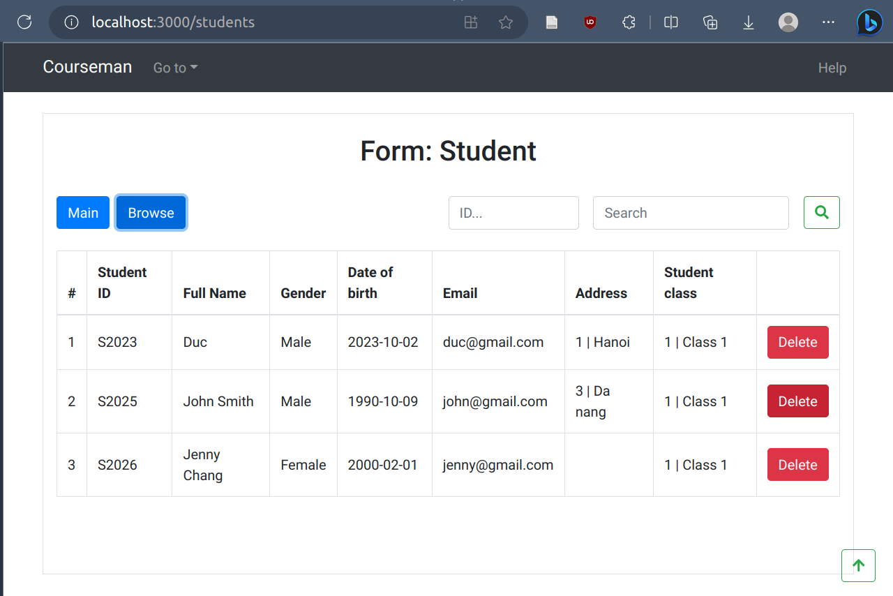

**Module Student: Read/Create/Edit object form**

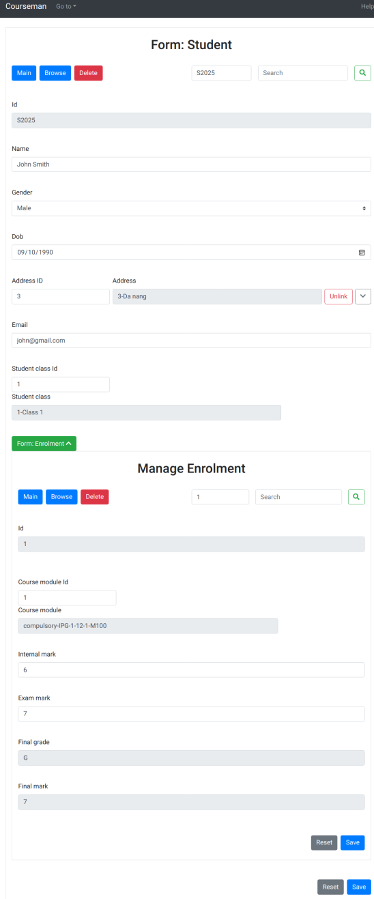

### Vuejs
**Module Student: Object table**

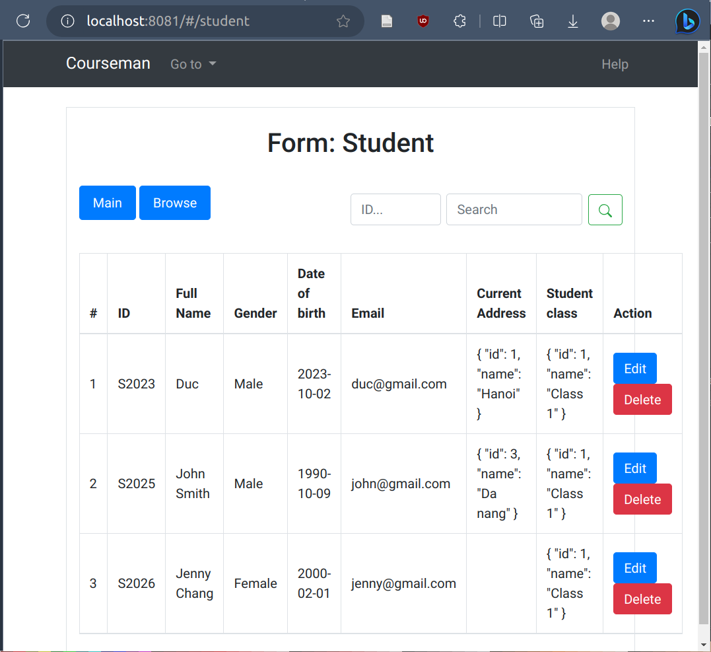

**Module Student: CRUD form**

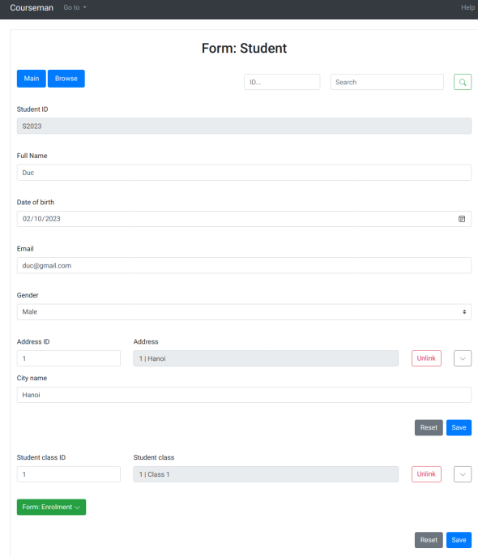

## ReactNative
Refer to the [instructions](../fereactnative/ReadMe.md) in the `Readme.md` file in the subfolder `fereactnative`.

Below is a description of the ReactNative app, which was taken from that ReadMe file and includes several screenshots.

| Component        | Description                                                                                                                                                                                                                                                                                                                                                                                                                                                                                                                                                                                                                                                        | Sample screenshot                                                          |
| ---------------- | ------------------------------------------------------------------------------------------------------------------------------------------------------------------------------------------------------------------------------------------------------------------------------------------------------------------------------------------------------------------------------------------------------------------------------------------------------------------------------------------------------------------------------------------------------------------------------------------------------------------------------------------------------------------ | -------------------------------------------------------------------------- |
| 1. Home screen   | Work as a modules browser, home screen allows user to browse to module screens                                                                                                                                                                                                                                                                                                                                                                                                                                                                                                                                                                                     | 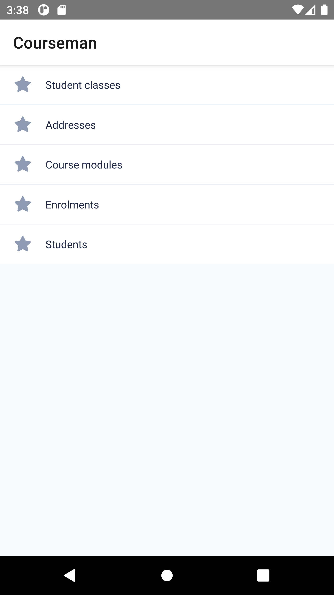               |
| 2. Module screen | As default, a module screen includes ListView (showed as default) and FormView. <br/> From ListView of module screen, user can: <br/> &nbsp;&nbsp; - Tap to "Add" button for opening "Create Form" screen <br/> &nbsp;&nbsp; - Tap to a list item for opening "Read only Form" screen <br/> &nbsp;&nbsp; - Tap to "Edit" button (pen icon) placed on each list item for opening "Edit Form" screen for a list item <br/> &nbsp;&nbsp; - Tap to "Delete" button (trash icon) placed on each list item for deleting a list item <br/> &nbsp;&nbsp; - Using page natigator for navigate between pages (default 20 items/ page)                                        | 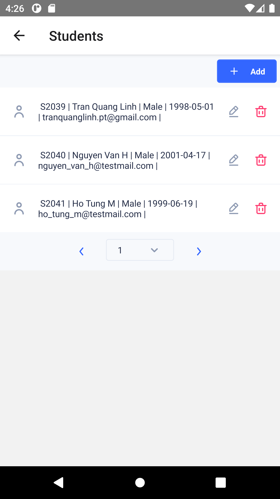      |
| 3. Form screen   | Support 3 modes: "Create", "Update" & "Read only". <br/> &nbsp; &nbsp;- In the "Create" and "Update" mode, ID field and automatic field (generated by server) will be disabled <br/> &nbsp; &nbsp;- In "Read only" mode, all input fields will be disabled <br/> Support "Module Input" and common input : "String", "Number", "Date", "Enum", v.v. <br/> Support data validation for common types of data:<br/> &nbsp; &nbsp; - Required (true \| false) - any data <br/> &nbsp; &nbsp; - Max/min (number) - number data only <br/> &nbsp; &nbsp; - Max length/ min length (number) - text data only <br/> &nbsp; &nbsp; - Pattern (regex string)- text data only | 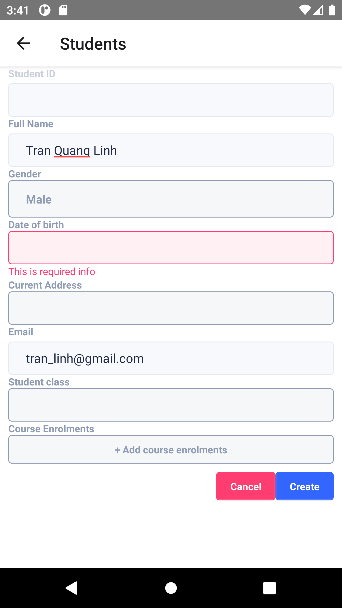 |
| 4. Module Input  | Module input allows user to chose a module record data as a field data in other module form data. <br/> &nbsp; &nbsp; - If a module record data selected via module input, user can tap to module input for opening detail screen of that module record data <br/> &nbsp; &nbsp; - Else, a bottom sheet will be showed with list of module record data for selecting. User can use search box for quick search data (**_Note that this feature has not work yet due to lacking search api of backend server_**) and "Create" button for creating new record data if data not exits                                                                                 | 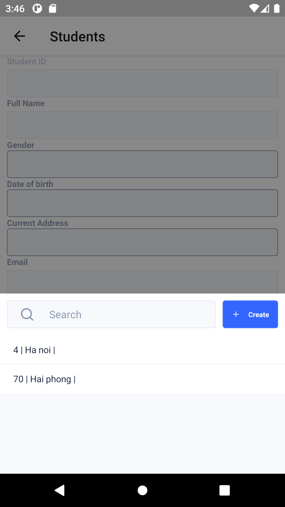       |
| 5. Multi Input   | Multi input allow form data to save a list of same type data in one field data. Each input field in Multi input work as same as a normal input.                                                                                                                                                                                                                                                                                                                                                                                                                                                                                                                    | 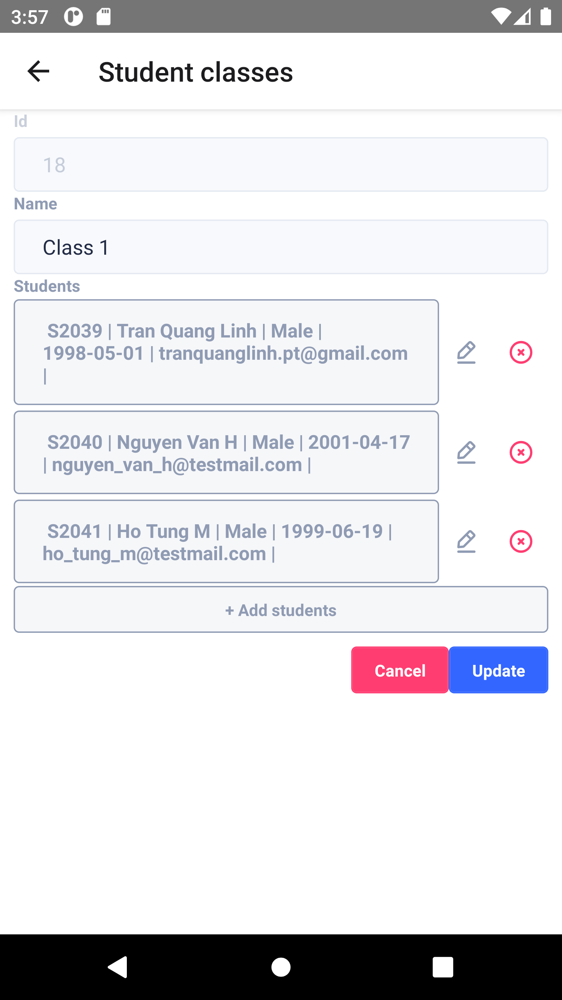        |

### Demo with CourseMan example:

|                                                                                                                                |                                                                                                        |                                                                                                 |
| ------------------------------------------------------------------------------------------------------------------------------ | ------------------------------------------------------------------------------------------------------ | ----------------------------------------------------------------------------------------------- |
|  <p align = "center">Route to modules from home screen</p>                | 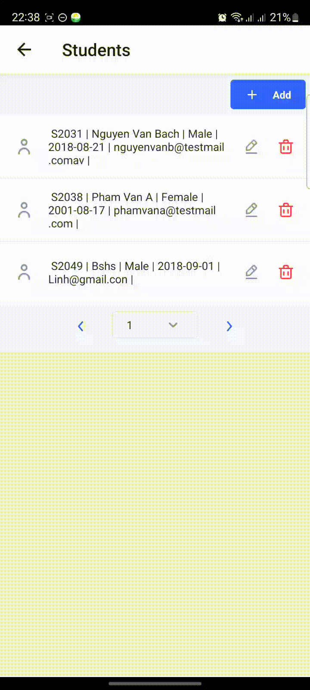<p align = "center">Show detail of module</p> |  <p align = "center">Create new item</p>   |
| <p align = "center">Edit an item</p>                                        | 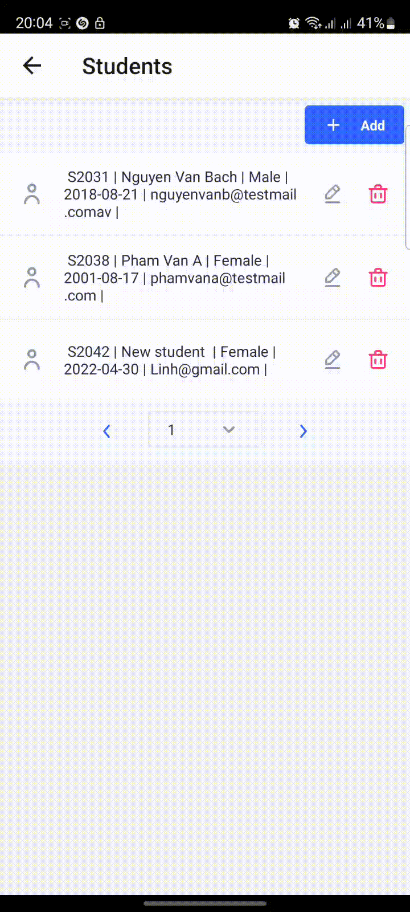 <p align = "center">Delete an item</p>           | 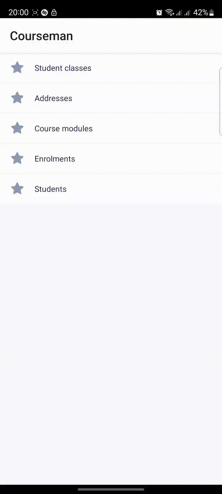 <p align = "center">Using multi input</p> |
|  <p align = "center">The form with type for genenric modules</p> |                                                                                                        |                                                                                                 |

### File structure

While many files are generated by JDA which depend on content of DDD model, there exits a base high-level file structure that remains consistent for all ReactNative app.

```
<AppName>
|─── android
|─── ios
|─── node_modules
|─── src
|    |─── base
|    |─── data_types
|    |─── modules
|─── app.json
|─── App.tsx
|─── index.js
|─── package.json
|─── tsconfig.json
```

| Directory / File | Description                                                                                                                                                                                 |
| ---------------- | ------------------------------------------------------------------------------------------------------------------------------------------------------------------------------------------- |
| android          | Contains the Android studio project                                                                                                                                                         |
| ios              | Contains the Xcode project                                                                                                                                                                  |
| node_modules     | Contains node dependencies                                                                                                                                                                  |
| src              | The main container of all the code inside application. Contain 3 main sub-foders: [base](#the-srcbase-folder), [data_types](#the-srcdatatypes-folder) and [modules](#the-srcmodules-folder) |

# SwGen example
Use SwGen to generate a frontend software in one of the target platforms (Reactjs, Vuejs, Angular, ReactNative).

1. Choose the target FE platform : (VUEJS | ANGULAR | REACTJS | REACTNATIVE) by config value `@RFSGenDesc.fePlatform`
   in `"MOSAR_EG_DIR"\src\main\java\org\jda\example\coursemanrestful\software\config\SCCCourseManDerby.java`
2. From within the `$MOSAR_EG_DIR`, generate the CourseMan RFS source code:
   `mvn exec:java@genrfs`

Generated outputs include:
- `frontend` source: `src/main/java/org/jda/example/coursemanrestful/frontend`
- `backend` source: `src/main/java/org/jda/example/coursemanrestful/backend`

3. compile again (to compile the generated code): 

    `mvn compile`

4. run the backend (SpringBoot application):

    `mvn exec:java@runbe`
    
5. run the frontend 
  - from the generated source code folder, named `frontend`, in step 2:
  - install dependencies (only needs to do this once; takes a few minutes!):
    `npm install`

**Reactjs**
  - run the app: `PORT=<your client port> npm run start`

**VueJs**
  - run the app: `npm run serve --port=<your client port>`  

**Angular**
  - run the app: `ng serve --port <your client port> ` (You might be install angular cli first: `npm install -g @angular/cli`)

**ReactNative**
  - Refer to the instructions in the `Readme.md` file in the generated source code folder `frontend` in step 1.

# Running CourseMan Tests
As usual for Maven, the test units are created under the `src/test` subfolder.
Use these test units to test the frontend and backend functionalities. 

## Backend/Domain model test units

### Overview
The domain model test units are designed to allow testing the domain model classes. 
1. `CRUDTestMaster`: the super-root of all test units 
2. Package `...test.modules` contain CRUD test units for each of the domain modules

Each CRUD test units test CRUD on the objects of one domain class using the default Derby embedded database. 

### Procedure
The **execution order** of the test units are as follows. Execute the test method `run()` of each unit on the IDE:

1. `address.CRUDAddress`: to create test address objects
2. `student.CRUDStudent`: to create test student objects
3. `coursemodule.CRUDCompulsoryModule`: to create compulsory module objects
4. `coursemodule.CRUDElectiveModule`: to create elective module objects
5. `coursemodule.CRUDEnrolmentModule`: to create enrolment objects

Use the following command to run a test class from the command line:
```
mvn test -Dtest=<fully-qualified-name-of-test-class>
```

For example, the following command execute the CRUDAddress test class:
```
mvn test -Dtest=org.jda.example.coursemanrestful.test.modules.address.CRUDAddress
```

## Running JDATool on the database 
To view the data objects on the built-in JDA's UI, execute the `CRUDTestMaster` class in the IDE as follows:
1. Configure the run configuration of the UI to access the database folder created by the test units. In Intellij (or the IDE of your choice), customise the run configuration of  the `CRUDTestMaster.main` method to specify the work directory as `.../jda/examples/courseman/mosar`.
2. Execute the `CRUDTestMaster.main` method

## Managing the database on SQuirrel SQL Client
You can manage the database using the Squirrel SQL client. Refer to [these instructions](https://github.com/jdomainapp/jda#using-squirrel-sql-client-gui-to-work-with-apache-derby) on how to do this. 

When the **domain model is changed**, you **must** use this SQL client to delete the database tables. The tool does not currently support auto update the database when these changes occur. 
