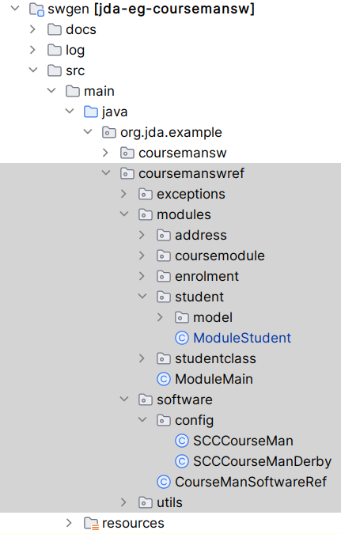
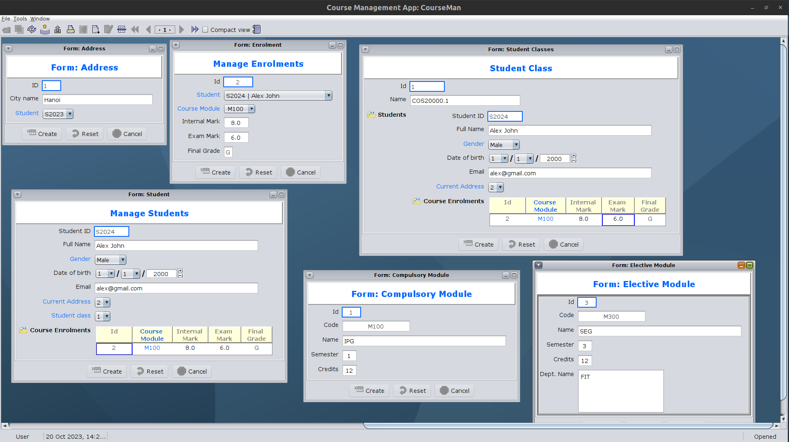
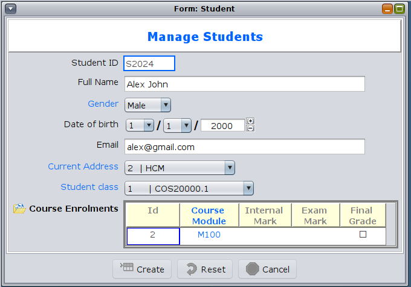
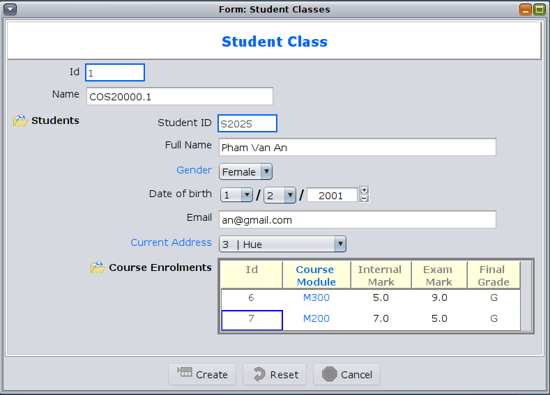

JDA Software: Auto-generation and beyond
--------------------------------------------

# Benchmark CourseMan software example
A full-featured version of the CourseMan application that is used to demonstrate extended set of functionalities of JDA. This covers all three aDSLs: DCSL, MCCL and SCCL.

To run the software:  
1. Use Maven command: `mvn exec:java` OR
2. Execute this main class in the IDE: `org.jda.example.coursemanswref.software.CourseManSoftwareRef`

**MCCL** is the main language that powers this CourseMan software. It allows developers to create a configuration for each module (called **MCC**) that customises the model, view and controller components.

The following figure shows the code project structure. The software modules are defined in the subpackage named `modules`. Each module basically consists of a model (subpackage `model`) and an MCC. This MCC is defined by the MCCL language. To ease discussion, we name each MCC after the module class; e.g. MCC(Student) is the MCC for Module(Student). Further, we name the view and controller of each module after the module class. For instance, View(Student) and Controller(Student) are the view and controller of the Module(Student). 



## The MCC of Module(Student)
The following code listing shows the content of MCC(Student). The class header is annotated with `@ModuleDescriptor`, which is annotation that captures design specification for the model, view and controller of a module. Each component specification is defined by  a separate annotation: `@ModelDesc` (for model), `@ViewDesc` (for view) and `@ControllerDesc` (for controller).

The MCC's body consists of detailed specifications for the view. It includes the title view field (named `title`) and a view field for each domain field of the model. In this example, there is one view field for each domain field of the `Student` class.

View field design specification is defined by the annotation `@AttributeDesc`. It constains elements that help to specify the presentation and behavioural elements of each view field. The presentational elements include label, view field class (type), color, font, alignment, layout and so on. 
The behavioural elements are specifically used for subview field and are typically specified as commands that customise certain operations of the subview's controller. 

```
@ModuleDescriptor(name = "ModuleStudent",
        modelDesc = @ModelDesc(
                model = Student.class),
        viewDesc = @ViewDesc(
            formTitle = "Form: Student",
            imageIcon = "Student.png",
            domainClassLabel = "Student",
            viewType= RegionType.Data,
            parent= RegionName.Tools,
            view = View.class),
        controllerDesc = @ControllerDesc(
            controller= Controller.class,
            isDataFieldStateListener = true
        )
    ,isPrimary=true
    ,setUpDesc = @SetUpDesc(postSetUp = CopyResourceFilesCommand.class)
)
public class ModuleStudent {
  @AttributeDesc(label = "Manage Students")
  private String title;

  @AttributeDesc(label = "Student ID")
  private int id;

  @AttributeDesc(label = "Full Name")
  private String name;

  @AttributeDesc(label = "Gender")
  private Gender gender;

  @AttributeDesc(label = "Date of birth")
  private Date dob;

  @AttributeDesc(label = "Email")
  private String email;

  @AttributeDesc(label = "Current Address",
      type = JComboField.class,
      ref=@Select(clazz= Address.class,attributes={"name"}),
      loadOidWithBoundValue=true,  // this must be set to true if
      displayOidWithBoundValue=true
      ,isStateEventSource=true)
  private Address address;
  
  @AttributeDesc(label = "Student class",
      type = JComboField.class,
      ref=@Select(clazz= StudentClass.class,attributes={"name"}),
      loadOidWithBoundValue=true,  // this must be set to true if
      displayOidWithBoundValue=true
      ,isStateEventSource=true)
  private StudentClass studentClass;
  
  @AttributeDesc(label = "Course Enrolments")
  private Collection<Enrolment> enrolments;
}
```

## The MCC of Module(StudentClass)

The following listing shows another MCC that demonstrates customisation of the MVC components of not only a module but also those of the descendant (nested) modules. `MCC(StudentClass)` has 2 descendant modules: `MCC(Student)` and `MCC(Enrolment)`.

The controller of `MCC(StudentClass)` is configured with open policy `OpenPolicy.O_C`, which means to load all objects from the storage and to expand the views of all the descendant modules. The figure below the lists illustrates this.
Further, the controller of the descendant `Module(Student)` is configured with the open policy `OpenPolicy.L_C`, which means to load (and show) all the objects and those of all the descendant modules. 

Together, the above open policies create the behaviour that when the user clicks the `Open` button on the view, all the `StudentClass` objects are loaded from storage. In addition, all the associated `Student` objects as well as all the `Enrolment` objects associated to each of those `Student` objects are also loaded. The `StudentClass` view and the 2 descendant subviews for `Student` and `Enrolment` are automatically opened with the first object on each load collection is presented on the view.  

```
@ModuleDescriptor(name = "ModuleSClass",
  modelDesc = @ModelDesc(
    model = StudentClass.class
  ),
  viewDesc = @ViewDesc(
    formTitle = "Form: Student Classes",
    domainClassLabel = "Student Class",
    imageIcon = "sclass.jpg",
    view = View.class,
    viewType = RegionType.Data,
    parent = RegionName.Tools
  ),
  controllerDesc = @ControllerDesc(
    controller = Controller.class,
    // open with all objects and open children
    openPolicy = OpenPolicy.O_C
  ),
  isPrimary = true,
  setUpDesc = @SetUpDesc(postSetUp = CopyResourceFilesCommand.class)
)
public class ModuleStudentClass {
    @AttributeDesc(label = "Student Class")
    private String title;

    @AttributeDesc(label = "Id")
    private int id;

    @AttributeDesc(label = "Name")
    private String name;

    @AttributeDesc(label = "Students", type = DefaultPanel.class,
      controllerDesc = @ControllerDesc(
        // default: openPolicy=OpenPolicy.I
        // load all student objects and those of the descendant modules
        openPolicy = OpenPolicy.L_C
      )
    )
    private List<Student> students;
}
```
## Generated Software

### Dashboard
The following figure shows the dashboard of the generated CourseMan software. 



## `View(Student)`
The following figure shows the close-up view of the Module(Student).


As can be seen from the above figures, the labels and texts on the module views are customised to show use-friendly contents; e.g. "Manage Students" and "Customer ID". Further, the view fields and some of the sub-views are also customised to show more user-friendly layouts.   

For example, `View(StudentClass)` in the first figure shows that the `Subview(Student)` is a Panel, which is a form layout that shows the details of each student in a student-class. This is different from the default tabular subview, as shown in the `Subview(Enrolment)` of the `View(Student)`.  

The following figure shows the close-up view of `View(StudentClass)`.



# Generated CourseMan Software example 

Demonstrates the software generation feature of JDA.

## Set up the example
1. clone/pull latest version of the the training repository.
   - Suppose the cloned folder is: `repo.folder` = `/home/test/jda-training/training`
   - The **Maven project** of this example:
      `proj.folder` = `${repo.folder}/jda/examples/jda-eg-coursemansw`
   - The `root.path`: `/home/test/`
   - the config file: `config.file` = `${proj.folder}/src/main/resources/swgenconfig.json`
2. Configure the root path:
  - change property `rootPath` in the `${config.file}` to the `${root.path}`
  - Note: if you are using Windows then you nedd to change all paths to use the double backward-slash `\\` as the path separator!
3. Install PostgreSQL RDBMS
   1. create database: `coursemands`
   2. database admin account: user = `'user'`, password = `'password'`

## How to run the CourseMan example from the IDE
1. Change configuration to compile generated source files
   - change property `compileSrc` in the `${config.file}` to `true`
2. Import the Maven project of the example into the IDE
3. Run class: `org.jda.example.coursemansw.swgen.CourseManSwGen`
4. Follow the instructions on the screen. Choose one command option at a time, in the displayed order.

## How to run the CourseMan example from the command line
Open 2 console terminals with the current dir set to `proj.folder`.

1. (Terminal 1) Compile the code (from the parent folder, to ensure that local-maven-repo is updated with any JDA's jar changes)
   1. cd into the parent folder: `.../examples`
   2. Compile source code: `mvn -U compile` (`-U` option is to activate the local-maven-repo updates)
2. (Terminal 1) Run the software: cd back into the `proj.folder` and
   `mvn exec:java@run`
3. (Terminal 1) Choose 'C' to generate software configuration
4. (Terminal 2) compile the source code: `mvn compile` (to compile the generated code)
5. (Terminal 1) Choose 'S' to generate the software class
6. Repeat step 4 to compile the generated code
7. (Terminal 1) Choose 'R' to run the software
     
## Study the example
1. Open the modules packages and study the generated MCCs
2. Open the software package and study the generated SCC
3. Experiment with different configuration settings of the MCCs, SCC 
4. Study the [two papers](https://github.com/jdomainapp/training/issues/6) published in 2019 and 2020 to know more about MCCL and SCCL
