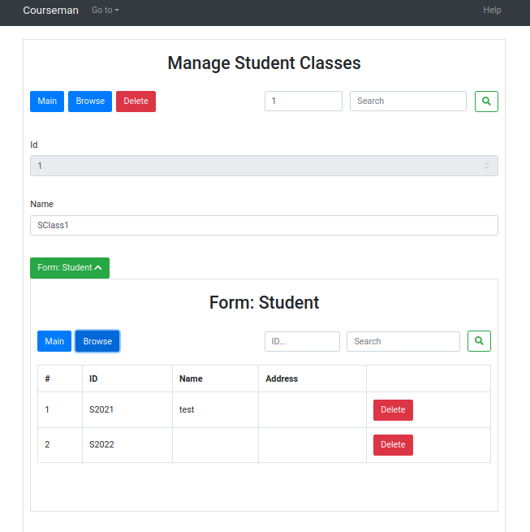

RFSTool - RESTful Full-Stack Web Software Generator
=========
# Version History:
- 1.0: before refactor
- 1.1: after refactor

# Set up
1. First-time installation:
   1. from the `jda` root folder, type the command: `mvn install -DskipTests=true`
2. Import the following Maven module project into your IDE:
   1. `module-restfstool`
3. Ensure that `module-restfstool` has the following source folders and that all are included in the build path:
  - `src/main/java` 
  - `src/example/java`
  - `src/test/java`
3. Ensure that all are compiled ok.

# Run `CourseManAppGenerator`
To generate front- and back-end components. 
- the back-end is executed by Spring Boot immediately after being generated
- the front-end needs to be executed as part of a separate React.js project (see next section)

1. Focus on `module-restfstool` in your IDE
  - Run this class:
`org.examples.jda.restfstool.rfsgen.CourseManRFSGen`
  - Ignore the "ClassNotFoundException" exceptions on the console
  - Wait until you see the following message block on the console. This means that:
    - both back-end and front-end have been generated
    - SpringBoot is executing the back-end
```
------------
(+) DomSoftware.init()
(+) DomSoftware.addClasses()
(+) DomSoftware.loadObjects()
(+) DomSoftware.loadObjects(CourseModule)
(+) DomSoftware.loadObjects(Enrolment)
(+) DomSoftware.loadObjects(Student)
(+) DomSoftware.loadObjects(Address)
(+) DomSoftware.loadObjects(StudentClass)
(+) DomSoftware.loadObjects(CompulsoryModule)
(+) DomSoftware.loadObjects(ElectiveModule)

  .   ____          _            __ _ _
 /\\ / ___'_ __ _ _(_)_ __  __ _ \ \ \ \
( ( )\___ | '_ | '_| | '_ \/ _` | \ \ \ \
 \\/  ___)| |_)| | | | | || (_| |  ) ) ) )
  '  |____| .__|_| |_|_| |_\__, | / / / /
 =========|_|==============|___/=/_/_/_/
 :: Spring Boot ::                (v2.4.2)

------------
```
2. Refresh `module-restfstool` to load the generated code into the IDE
3. The generated code is in `src/example/java`:
   1. back-end: in the package `com.hanu.courseman.backend`
   2. front-end: in the package `com.hanu.courseman.frontend` (React.js)
  
# Execute the front-end
1. Set up
   1. Install Node.js with command `npx` (will be used to create React.js project)
2. Create a Reactjs frontend project with the generated front-end source code

- Assume: 
  - `$RestfsRool-Dir`: the directory of `module-restfstool`
  - `$RestfsRool-Dir/front-end-courseman`: sub-folder for the front-end project

```
cd $RestfsRool-Dir/front-end-courseman

npx create-react-app demo-courseman-react

cd demo-courseman-react

cp -r $RestfsRool-Dir/src/main/resources/react/base $RestfsRool-Dir/src/main/resources/react/common src/

```

- Copy the `dependencies` from `$RestfsRool-Dir/src/main/resources/react/package.json` to `demo-courseman-react/packages.json`

- Add Bootstrap 4.5 css, js to `demo-courseman-react/public/index.html`
```
<link rel="stylesheet" href="https://cdn.jsdelivr.net/npm/bootstrap@4.5.3/dist/css/bootstrap.min.css" integrity="sha384-TX8t27EcRE3e/ihU7zmQxVncDAy5uIKz4rEkgIXeMed4M0jlfIDPvg6uqKI2xXr2" crossorigin="anonymous">

<script src="https://code.jquery.com/jquery-3.5.1.slim.min.js" integrity="sha384-DfXdz2htPH0lsSSs5nCTpuj/zy4C+OGpamoFVy38MVBnE+IbbVYUew+OrCXaRkfj" crossorigin="anonymous"></script>
<script src="https://cdn.jsdelivr.net/npm/bootstrap@4.5.3/dist/js/bootstrap.bundle.min.js" integrity="sha384-ho+j7jyWK8fNQe+A12Hb8AhRq26LrZ/JpcUGGOn+Y7RsweNrtN/tE3MoK7ZeZDyx" crossorigin="anonymous"></script>
```

- Copy the generated frontend code to `demo-courseman-react`

```
cp -r $RestfsRool-Dir/src/examples/java/com/hanu/courseman/frontend/* src/
```

- Install and run `demo-courseman-react`:

```
npm install

npm start
```

3. Access `localhost:3000` on the browser to start using the front-end

Figure below shows the front-end.



# Execute back-end software (without the generator)
To execute the CourseMan back-end software that has been generated by RFSGen: 

Run this class in your IDE:
```
org.jda.example.restfstool.rfsgen.CourseManBESoftware
```

# How to create a project to run the generated code
1. Create a Maven project named "CourseMan" (JDK >= 13)
2. Extra the zip file module-restfstool-5.4-SNAPSHOT-deploy.zip and include all the extracted .jar files as libraries of the project
3. Run the backend:
   1. Copy the folder src/example/java/com to the src/main/java folder of the project
   2. Copy the folder src/main/resources to the src/main/resources folder of the project
   3. Run CourseManRFSBERun.java
4. Run the frontend in Node.js:
   1. copy the provided project template to create the project folder: `courseman-fe`
   2. copy the content of package `frontend` into the folder `courseman-fe/src` 
   3. cd into the project folder:
      1. (do this once) run command `npm install`
      2. command `npm start`